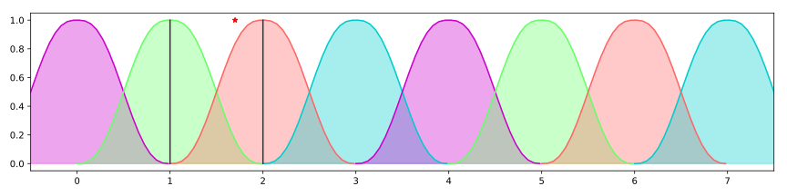
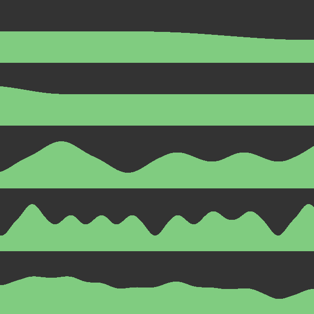
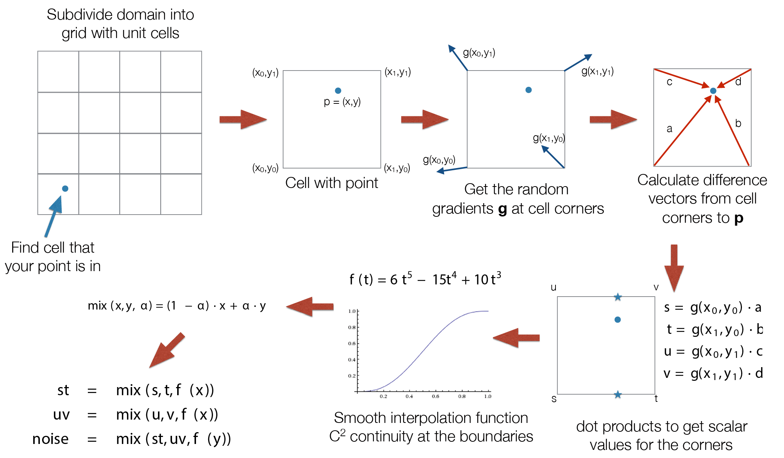
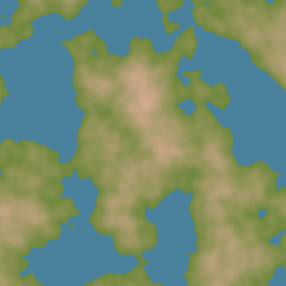
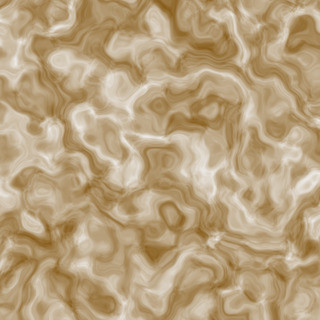
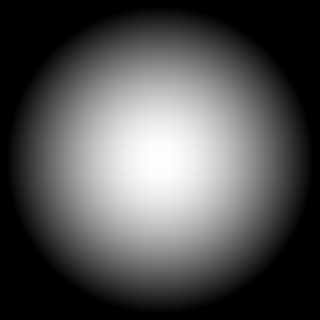
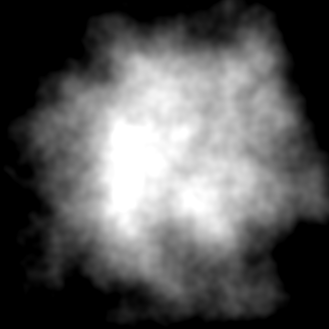
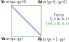

<figure class="captioned">
<video src="doc/wl_lightning_composite.mp4" type="video/mp4" loop autoplay controls ></video>
<figcaption>Particle effects using noise functions.</figcaption>
</figure>

[Procedural generation](https://en.wikipedia.org/wiki/Procedural_generation)
is a valuable tool for game development and visual effects:
instead of manually building every asset (meshes, textures, world maps, etc.), 
we specify algorithmic rules to create numerous variations of the asset.
In this assignment, we will implement Perlin Noise and use it to generate textures and 3D terrains.

## 1. Noise

Let us define an $n$-dimensional noise function $f : \mathbb{R}^n \rightarrow \mathbb{R}$
taking as input an $n$-vector and returning a scalar.
For example, 2-dimensional noise can be represented as a 2D texture,
where the brightness at point $p$ of the image represents $f(p)$.

<figure id="perlin_noise_2d_sample" class="captioned">
	
	<figcaption>**Perlin 2D noise sample**</figcaption>
</figure>

This function should have the desirable properties mentioned in lecture:
no obvious repetitiveness, rotation invariance, smoothness (band-limited), computational efficiency, and
reproducibility.

There are many different types of noise functions used in graphics.
Two common categories are **value noise** and **gradient noise**.
Both approaches generate pseudorandom values on a grid
(whose points are typically placed at the integer coordinate locations of $\mathbb{R}^n$) and then interpolate
them. Value noise methods generate random *values* at the grid points and
interpolate them with standard polynomial interpolation, convolution, or some other technique.
Gradient noise methods instead generate random *gradients* at the
grid points and apply Hermite interpolation. Interpolating gradients instead of
values allows us to get higher degree (smoother) noise functions with more
local (efficient) calculations.

In this assignment, we will implement Perlin noise, a gradient noise technique
so popular that some use the names "Perlin noise" and "gradient noise" interchangeably.
There are many online resources on Perlin noise, 
for example [*Understanding Perlin Noise*](http://flafla2.github.io/2014/08/09/perlinnoise.html)
(the only difference in their implementation is the hash function they use).

## 2. Perlin Noise in 1D

Let us investigate the 1D case of Perlin noise step by step.
We will implement the function `perlin_noise_1d` in `src/shaders/noise.frag.glsl`.
Run `index_textures.html` to visualize the results of your implementation.

### Find the surrounding cell corners

Grid points appear at integer coordinates.
In 1D, a cell is just an interval $[c_i, c_{i+1}]$.
We can find the left endpoint ("cell corner") of this interval by applying the [`floor`](https://www.khronos.org/registry/OpenGL-Refpages/gl4/html/floor.xhtml) function to $p$,
$$
	c_i = \lfloor{p}\rfloor.
$$
The right endpoint will be $c_{i+1} = c_i + 1$.

An example is given in the following figure:

<figure class="captioned" id="fig_perlin_gradients_1d">
	</img>
	<figcaption>**Perlin gradients 1D**  
	Dotted lines: linear functions at the cell corners that will contribute to the noise values.  
	Blue line: final interpolated result.
	</figcaption>
</figure>

where $p = 1.7$ is marked with a red star.
The neighboring grid points are 1 and 2, marked with vertical gray lines.

### Determine gradients $g$ at cell corners

The noise should be deterministic, meaning we get the same result every time we
run it---regardless of what computer we run it on---but still "look" random. Therefore, we need a
repeatable way to assign gradient vectors to cell corners. 
In the original Perlin noise method from 1985, a large lookup table of random gradients was pre-computed, 
and a hash function was used to map $n$D grid point indices in $\mathbb{Z}^n$ to 1D indices into this lookup table. 
In the improved version from 2002, a table of only 12 specially chosen gradients listed in
[Perlin's article](https://dl.acm.org/doi/10.1145/566654.566636) was used. 
Perlin's justification for this simplified table is that human vision is relatively insensitive
to the granularity of orientations, so randomly choosing from 12 different
directions is enough to fool your eye into thinking the pattern is rotationally invariant.

We will use this improved approach. We define a hash function $h : \mathbb{Z}^n \rightarrow \{0, 1, \dots, 11\}$ 
to deterministically assign an integer to every grid point $c_i \in \mathbb{Z}^n$ and then use this integer to choose from the table of 12 gradients:
$$
    g_i = \mbox{gradients}(h(c_i)).
$$
Provided our hash function assigns integers to grid points in a somewhat random-looking way,
the gradient assignment will also appear random.

Due to limitations in the older versions of GLSL we need to support, we cannot
actually implement the gradient lookup table with an array—indexing arrays with
an integer variable was only introduced in GLSL ES 3. We instead provide a function `gradients(i)`
that returns the appropriate gradient.

The hash functions used for Perlin noise are based on a pseudorandom permutation
$P$ of the integers $\{0, \dots, N\}$. For example, for 2D grids, the hashed
value of an integer point $(i, j)$ is computed by evaluating $P(i + P(j))$. 
We assume the input of $P$ is first reduced modulo $N$.

Most CPU-based Perlin noise implementations use a fixed permutation, stored in an array of integers. 
However, this table-based approach is not as well suited for the GPU architecture. 
For this assignment in GLSL, we use the function $P(x) = (34 x^2 + x) \mod 289$, which
gives a random-looking permutation of the integers $\{0, \cots, 288\}$, and is efficient to evaluate. 
A hash function based on this permutation is already implemented for you in `hash_func`.

### Calculate contributions

The gradient chosen for each corner $c_i$ defines a linear function over
all of $\mathbb{R}^n$:
\begin{equation}
\label{eq:contribution}
\phi_i(p) = g_i (p - c_i).
\end{equation}
This is the unique linear function taking value $0$ and gradient $g_i$ at $c_i$.

When evaluating the noise function at $p$, we simply interpolate the values of
each corner's linear function at $p$. The linear functions for each grid point are plotted
as dotted lines in Figure [Perlin gradients 1D](#fig_perlin_gradients_1d).
The value at $p = 1.7$ will be an interpolation of the linear functions $\phi_1$ and $\phi_2$,
plotted as green and red lines.

### Interpolate contributions

The final value of our noise at $p$ is a weighted average of the linear 
functions $\phi_i$ for $p$'s surrounding cell corners.
The idea is to smoothly interpolate the values of these linear functions based
on how close $p$ is to each corner. 
Let's assume $p$ lies on the interval between corners $c_i$ and $c_{i + 1}$ and its location within the interval is parametrized by $t = p - c_i \in [0, 1]$.

We use the [`mix`](https://thebookofshaders.com/glossary/?search=mix) function,
which performs linear interpolation between values $x$ and $y$ with the weight $\alpha$:
when $\alpha = 0$ it yields $x$ and when $\alpha=1$ it yields $y$.
$$
\mbox{mix}(x, y, \alpha) = (1-\alpha) x + \alpha y.
$$
However, we do not simply want to linearly interpolate the values of the
corner's functions; this would
lead to severe discontinuities in the gradient of our noise function.
Instead, to ensure our noise function is smooth across the grid points, we
calculate the interpolation weights using the polynomial:
$$
    \alpha(t) = 6t^5 -15t^4	+10 t^3.
$$

The weights of each corner's contributions are plotted in the following figure:

<figure class="captioned" id="fig_perlin_interpolation_1d">
	</img>
	</img>
	<figcaption>
    **Perlin Interpolation 1D**: Interpolation weights for the 1D Perlin noise (top); result (blue curve)
    of blending the linear functions $\phi_i$ (dotted lines) with the interpolation weights.
	</figcaption>
</figure>

For example, when $p$ is close to $c_1 = 1$, $t$ is small, and therefore the
result is dominated by the contribution of $\phi_1$. So near 1, the interpolated
blue line closely follows the green dashed line. 
When $p$ is close to $c_2 = 2$, $t$ is approximately 1, and the red dashed line dominates the result.

### Task 2.1: 1D noise

Implement the 1D Perlin noise in function `perlin_noise_1d`.
Press **1** to see your results. They should look like the following figure: 

<figure class="captioned" id="fig_plots_1d">
	</img>
	<figcaption>**Noise plots 1D**: Top 4 plots depict the Perlin noise function at different frequencies.
		The bottom plot shows the weighted sum of these octaves (fBm).
		The Y range of the plots is $[-1, 1]$.
	</figcaption>
</figure>

The different plots display your noise function at different frequencies (see section below).
The last plot is fBm, which you will implement later.

**Note**: a correct result will not be identical to the images shown here.
The reference noise functions are shifted along the X axis.

## 3. Fractional Brownian Motion

Textures in nature have both low frequency (general shape) and high frequency (detail) components.
In order to mimic this effect, we combine noise at different frequencies;
the resulting noise function is called fractional Brownian motion (fBm).
[Brownian motion](https://en.wikipedia.org/wiki/Brownian_motion) is the physical phenomenon where many small particles hit a heavy particle, 
with each collision contributing momentum in a different direction, resulting in random irregular motion of the big particle.
If you want to know more about fractional Brownian motion, please have a look at [this](https://thebookofshaders.com/13/) nicely made tutorial.

To obtain the noise at frequency $\omega$, we multiply the input point $p$ by $\omega$, evaluating the noise value $f(p \, \omega)$.
The noise functions at the various scaled frequencies are called *octaves*, and just as with musical octaves, the frequency rises exponentially with each octave.
So for the $i$-th octave, we have $\omega_i = \omega_1^i$.

We want the contributions of the high octaves to be small details on top of dominant lower frequencies.
Therefore, we reduce the amplitude of the noise with each octave, also exponentially.
The weight for the $i$-th octave is $A_i = A_1^i$, where $A_1 \in [0, 1]$.

The final result is therefore:
$$
\mbox{fbm}(p) = \sum_{i=0}^{N - 1} A_1^i f(p \, \omega_1^i).
$$

In the code, $\omega_1$ is `freq_multiplier`, $A_1$ is `ampl_multiplier`, and $N$ is `num_octaves`.

**Turbulence** is very similar to fBm: the only difference is we sum the *absolute values* of octaves:
$$
\mbox{turbulence}(p) = \sum_{i=0}^{N - 1} A_1^i |f(p \, \omega_1^i)|.
$$

### Task 3.1: fBm 1D

Implement the 1D fractional Brownian motion in function `perlin_fbm_1d`.
The expeected result is displayed at the bottom of the [Noise plots 1D](#fig_plots_1d) figure.

## 4. Perlin Noise 2D

Now we extend the algorithm to 2D; the 2D process is also described in the lecture slides on procedural modeling.

There are several differences compared to the 1D case:

* Each cell has 4 corners. We can still get one of the corners
using $c_{ij} = floor(p)$ and obtain the others by adding appropriate offsets to $c_{ij}$.
	
* The contribution equation
\begin{equation}
	\phi_i(p) = g_i \cdot (p - c_i).
\end{equation}
now operates on 2D vectors. The symbol $\cdot$ indicates a dot product.
	
* The interpolation now has two steps, one per dimension:
the two pairs of contributions at the top and bottom of the cell are first
interpolated along the $X$ axis ($st$ and $uv$ in the diagram), and then
this result is interpolated along the $Y$ axis.
(The $x$ and $y$ in the slide's formulas mean $p$'s *relative position inside the cell*.)

With this 2D Perlin noise function, we can use exactly the same procedure
described in the [fBm section](#fractional-brownian-motion) to implement 2D variants of fBm and
turbulence.  

<figure >
	</img>
</figure>

### Task 4.1
Implement 2D Perlin noise in the function `perlin_noise`.
Press **2** to see your results.

### Task 4.2
Implement 2D fBm in the function `perlin_fbm`.
Press **3** to see your results.

### Task 4.3
Implement 2D turbulence in the function `turbulence`.
Press **4** to see your results.

**Shader viewer:**
The code we provide includes an interactive noise viewer.
You can move around your texture by clicking and dragging with the mouse
and change the scale with the scroll-wheel.
Press **s** to download a `png` of the current texture.

## 5.  Textures

<figure class="col3" id="fig_textures">
	
	
	
	<figcaption>*(a)* Map</figcaption>
	<figcaption>*(b)* Marble</figcaption>
	<figcaption>*(c)* Wood</figcaption>
</figure>

The primitive noise functions you have implemented can be used to procedurally generate many different textures.

**World Map**:
we interpret the noise value $s = \text{fbm}(p)$ as a terrain elevation.
If $s$ is below the water level, we give it the color of water.
Otherwise we interpolate (mix) between between the grass color and the mountain color
with weight $\alpha = \left(s - s_{\mbox{water}} \right)$.

**Wood**:
described in [this article](http://lodev.org/cgtutor/randomnoise.html),
is an interpolation between dark brown and light brown, with the following weight $\alpha$:
\begin{align*}
	\alpha = & \frac{1}{2}( 1 + \sin( 100 \left( ||p|| + 0.15 \; \text{turbulence}(p)\right) ) ). \\
\end{align*}

**Marble**:
described in [this article](http://www.iquilezles.org/www/articles/warp/warp.htm),
is an interpolation between white and dark brown, with the following weight:
\begin{align*}
    \alpha = & \frac{1}{2}(1 + \text{fbm}(p + 4 q)), \ \text{where} \\
q = & (\text{fbm}(p), \text{fbm}(p + (1.7, 4.6) ) ).
\end{align*}
Note, this is an example of the domain distortion/warping technique, where the
output of one noise function is used to perturb the input to another. The
result is the swirly pattern shown in image *(b)*.

### Task 5.1
Implement those textures in functions `tex_map`, `tex_wood`, `tex_marble`.
Press **5**, **6**, **7** to see your results.
As before, you can move around, zoom in/out or take screenshots.

**Note**: a correct result will not be identical to the images shown here.
The reference textures are shifted along the X and Y axes.

### Noise texture examples - particle systems 

We used noise functions to generate textures and procedural terrain.
They can also be powerful tools to generate for smoke, cloud or fire-like effects.

Here are some examples.
That is something you might try out for your project!

#### Cloud texture

Start with a gaussian:

$$ d = ||(u, v) - (\frac{1}{2}, \frac{1}{2})||^2 $$

$$ g =  2 \exp( -3 d ) - 1 $$

Perturb with noise:

$$ f(u, v) = g + \frac{1}{2} fbm(u, v)  $$

<figure class="row">

</figure>

#### Particle smoke

If we add this texture to a particle system, we can achieve a smoke effect.

<figure>
<video src="doc/smoke_particle_effect_cut.mp4" type="video/mp4" loop autoplay controls ></video>
</figure>

#### Complex particle systems

Here is a more complex particle system [Krzysztof Lis](https://adynathos.net/), a former teaching assistant who designed the whole series of homeworks for this course, made.
The noise functions are used both for particle textures and to drive some of their movement paths.
The demos in this document are implemented using [Unreal Engine's "Niagara" particle system](https://docs.unrealengine.com/en-us/Engine/Niagara).

<figure>
<video src="doc/wl_lightning_composite.mp4" type="video/mp4" loop autoplay controls ></video>
</figure>

## 6. Terrain

<figure class="col2" >
	
	
	<figcaption>**Procedural terrain**:  
	the elevation is equal to the value of fBm.
	(The shading might look slightly different than here)</figcaption>
	<figcaption>**Grid cell**:  
	Tiling a grid cell with triangles.</figcaption>
</figure>

In the previous section, we built a map texture of our procedurally generated world.
Now let us build the terrain in 3D, as shown in the figure above.
To that end, we will build a 3D triangle mesh, which consists of:

* **Vertices** $v_0, v_1, \ldots, v_{N_v-1} \in \mathbb{R}^3$: points in 3D space.
* **Faces** $f_0, \ldots, f_{N_f-1} \in \{0, 1, \dots, N_v-1\}^3$.
	Each face is a triangle spanning three of the mesh's vertices,
	specified by their index.
	For example, the face $f_i = (3, 7, 8)$ spans between $v_3$, $v_7$ and $v_8$.

* **Normals**. We provide vertex normals calculated using finite difference approximations of the height map's gradient.

Please look at the function `terrain_build_mesh` in `src/terrain.js`.

In the first part, we construct the vertices on a rectangular grid in the $XY$ plane.
The **world XY** coordinates of the vertex should be such that the vertices span a uniform grid from $-0.5$ to $0.5$
(this is an arbitrary choice, which we made to have select a suitable width of the grid compared to the height of the terrain).
You will have to convert the integer grid coordinates $(g_x, g_y)$ into 2D points in the range $[-0.5, 0.5]^2$.

The **world Z** coordinate of each vertex is determined by the fBm value at that point.
We already provide you with a custom fBm function to achieve the desired terrain shape (see `tex_fbm_for_terrain` in `src/shaders/noise.frag.glsl`).
The output of this noise function is stored in the variable `height_map`, which can be accessed from the grid coordinates using `height_map.get(g_x, g_y)`.

We want to produce flat lakes in all the regions where the height value falls below the `WATER_LEVEL`:

* the vertex *Z* should be clamped back to `WATER_LEVEL`
* the normal should be overriden to $[0, 0, 1]$.

Vertices must be fed into GPU memory as a 1D sequence $v_0, v_1, \ldots, v_{N_v-1}$,
so we "flatten" the grid position $(g_x, g_y)$ into the 1D index $(g_x + \mbox{width}*g_y)$;
this conversion is done by the function `xy_to_v_index`.

Finally, we must connect these grid vertices with triangles to cover the plane.
To that end, in the second loop, we will fill each grid square by generating two triangles,
as shown in the [Grid cell](#fig_grid_cell) figure.

### Task 6.1

* Copy the `update_cam_transform` function from your previous exercise solutions to `src/main_terrain.js`.

* Implement the mesh construction function `terrain_build_mesh` in `src/terrain.js` to generate the `vertices` and `faces` arrays:
  * Convert the integer grid coordinates $(g_x, g_y)$ into 2D points in the range $[-0.5, 0.5]^2$.
  * Clamp the height value whenever it falls below the `WATER_LEVEL`; adjust the normal accordingly.
  * Triangulate the grid cells as shown in the [Grid cell](#fig_grid_cell) figure..

* Complete the terrain coloring shaders `src/shaders/terrain.*.glsl` by adapting your solution for the map texture. Set the color through the variable `material_color`. Configure the `shininess` to be 30.0 for water and 2.0 for terrain.

* Copy over to `src/shaders/terrain.*.glsl` your Blinn-Phong implementation from GL2 (the attenuation coefficient used in GL3 is not needed here).
As in GL2, use the same material color for the diffuse, specular, and ambient components. We assume $\mathbf{m}_{d}$ = $\mathbf{m}_{s}$ = `material_color` (i.e. the coefficients `material.diffuse` and `material.specular` from RT2 are unitary), and $\mathbf{m}_a$ = `material_color * material_ambient`, where `material_ambient = 0.1`.

Run `index_terrain.html` to see the result.

## Grading

* **15%** Task 2.1: 1D Perlin noise
* **10%** Task 3.1: 1D fBm
* **25%** Task 4.1: 2D Perlin noise
*  **5%** Task 4.2: 2D fBm
*  **5%** Task 4.3: 2D Turbulence
* **15%** Task 5.1: Textures (Map, Wood, Marble, 5% each)
* **25%** Task 6.1: Terrain

### What to hand in

Please briefly describe in the `readme.md` file how you solved the proposed exercises (approximately 10 to 20 lines). In the same file, report individual contributions following this scheme (sciper in parentheses):

	Name1 Surname1 (000001): 1/3
	Name2 Surname2 (000002): 1/3
	Name3 Surname3 (000003): 1/3

We ask you to only report global contributions, there is no need to provide additional details for each sub-task. The three contributions should add up to 1.

Compress the directory with all the files it contains – the source code with your solution, the source code you did not modify, the libraries, the readme, etc. – into a `.zip` archive. Rename the zipped file into `Exercise6-GroupGI.zip`, where `GI` is your group number, according to the group your are enrolled in on Moodle.

Note that it is your responsibility to check that all the components necessary to run the code are included. We will run your web app to generate the results. These results will determine your grade.

