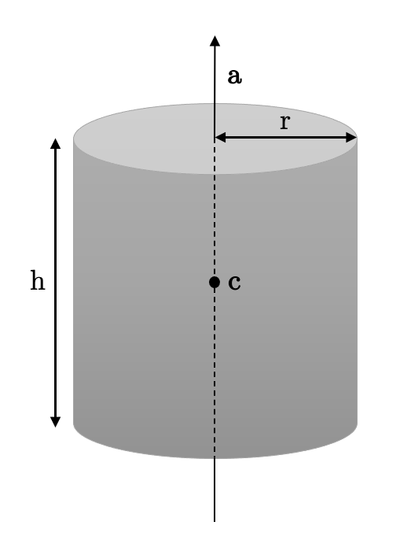

# Theory Exercise Homework 1 (RT1)

## Ray-Cylinder Intersection

{width="300px"}

In the following, we will note $c$ the center of the cylinder, $a$ its axis, $h$ is height, $r$ its radius, $o$ the origin of the ray, $d$ its direction, $t$ the distance between $o$ and the intersection point and $n$ the normal pointing toward the viewer at the intersection point.

To find the intersection of the cylinder and the ray, we first have to find the implicit equation for the cylinder and once we find it, we can combine it with the explicit equation of the ray.

To compute the distance of the point to the cylinder axis, we can compute the vector between the point $p$ (the point we want to check belongs to the cylinder) and $c$ (the cylinder center) and subtract to it the vector of the height of the point $p$ compared to $c$. This will give us the vector of the distance of $p$ to the axis of the cylinder.

The first vector can be found with the following computation

$$
\begin{equation}
p-c
\end{equation}
$$

The second vector can be found with the following computation

$$
\begin{equation}
[(p-c)\ \cdot a] * a
\end{equation}
$$

$(p-c)\ \cdot a$ gives us the height and multiplying it by $a$ gives us the height vector.

Combining them, we get that the distance of $p$ to the axis of the cylinder can be computed in the following way

$$
\begin{equation}
||(p-c) - [(p-c)\ \cdot a] * a ||
\end{equation}
$$

So to check that $p$ belongs to the cylinder we have to check that the distance to its axis is $r$. By also replacing $p$ with the explicit equation of the ray ( $p = o + d*t$ ), we can get the equation we need to solve.

$$
\begin{equation}
||(o + d*t -c) - [(o + d*t-c)\ \cdot a] * a ||= r
\end{equation}
$$

Using the technique seen in class, we square the entire equation to make the norm easier to manipulate, and rearrange the values to isolate t.

$$
\begin{equation}
||(o + d*t -c) - [(o + d*t-c)\ \cdot a] * a || ^2= r^2\
\end{equation} 
$$
$$
\begin{equation}
||\ [(o - c) - ((o-c) \cdot a) * a] + t*[d - (d \cdot a) * a]\ || ^2= r^2\
\end{equation}
$$

To make this easier to read, we can note this as 

$$
\begin{equation}
|| x + t* y || ^2= r^2
\end{equation}
$$
$$
\begin{equation}
|| x + t* y || ^2 - r^2 = 0
\end{equation}
$$

with 
$$
\begin{equation}
x = (o - c) - ((o-c) \cdot a) * a
\end{equation}
$$
$$
\begin{equation}
y = d - (d \cdot a) * a
\end{equation}
$$

To calculate the norm, we can use the fact that $||z||^2 = z\cdot z$ with $z$ a vector.

$$
\begin{equation}
|| x + t* y || ^2 - r^2 = x\cdot x + 2t* (x\cdot y) + t^2* (y\cdot y)
\end{equation}
$$

This is a quadratic equation and we can solve it to find $t$. We will either find 0, 1 or 2 solutions. Up to this point, we have considered that we have an infinite cylinder. To check that the points we find actually belong to our finite cylinder. To check that, we check that the absolute value of their height is smaller than $\frac{h}{2}$.

$$
\begin{equation}
|(p-c)\ \cdot a| \leq \frac{h}{2}
\end{equation}
$$

Now that we have filtered the points that actually belong to our finite cylinder, we look at the number of solutions. If there are none, our ray does not intersect the cylinder. If there is one, that is our solution. If there are two, we take the one with the smallest distance, because when the ray is going to intersect with the closest point, the ray will bounce back and not intersect the farthest point.

Finally, we need the normal. We already computed a radius vector between the $p$ and $c$, we just need to choose $p$ to be our intersection point $p = o + d*t$, here with $t$ our chosen solution :

$$
\begin{equation}
(p-c) - [(p-c)\ \cdot a] * a
\end{equation}
$$

It is already going in the right direction, we just need to normalize it. Since we know that its size is the radius of the cylinder, to normalize it, we just divide it by the radius.

$$
\begin{equation}
n = \frac{(p-c) - [(p-c)\ \cdot a] * a}{r}
\end{equation}
$$

The last thing we need to check is that the normal is pointing toward the viewer. We know that when two vectors are pointing in opposite directions, their scalar product should be negative, and we want the normal and the ray direction vector to be pointing in opposite directions. So if the scalar product of the normal and $d$ is positive, we turn the normal around by negating each of its coordinates.